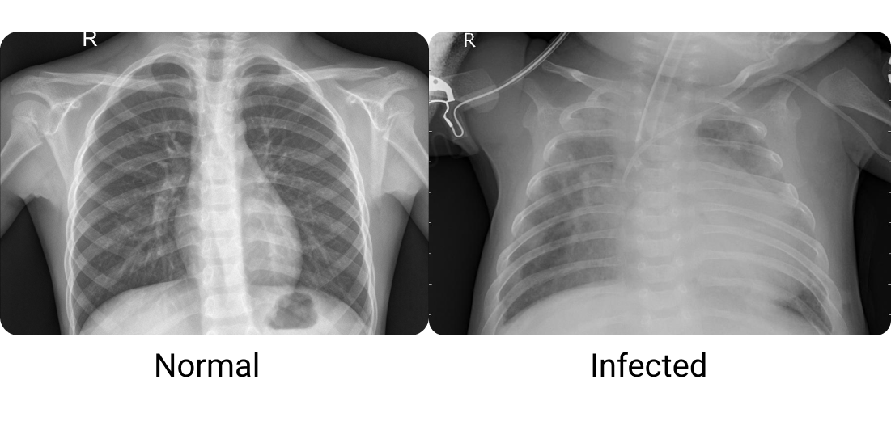
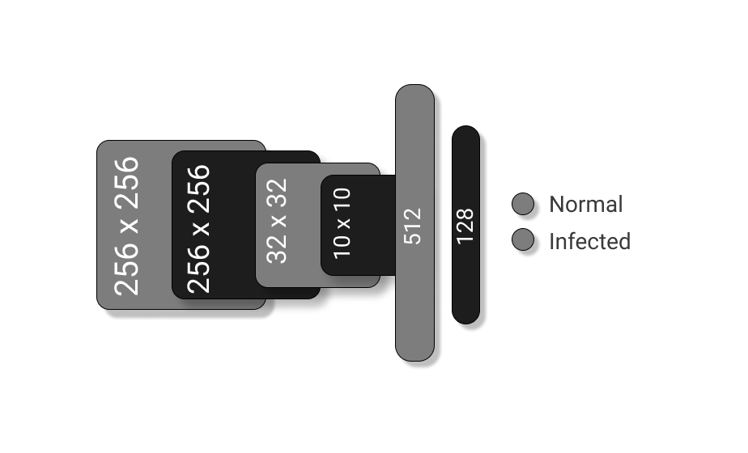

# Pneumonia-Detection
Classify normal and pneumonia infected lungs based on chest X-rays.
Classification based on [dataset](https://www.kaggle.com/paultimothymooney/chest-xray-pneumonia) by Paul Mooney.

### Preprocessing
- The images were converted from RGB to grayscale and then scaled with a maxima of 255 per pixel.
- The images were resized to 500 x 500 px, 200 x 200 px, 50 x 50 px to compare accuracies.
- Then the images were labeled and converted into tensors.

#### The model's architecture

### Training
- 3 models were trained for image sets of different resolutions.
- Binary crossentropy loss.

### Results
- Training accuracy of > 94 percent for all the models.
- Out of sample accuracy of > 83 percent for all the models with different resolutions.
